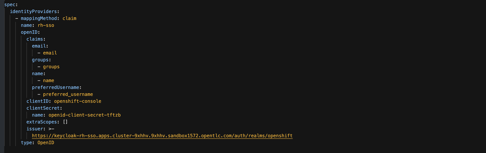

## Configuring Keycloak as a Identity Provider inside the cluster.

1. Go to the OCP console as kube admin
2. Go to Adminstration -> Cluster Setting -> Configuration -> OAuth
    * Go to Identity Provider
    * Select OpenId Connect
    * In the `clientId`, Enter the clientId created in Keycloak
    * Add the token for the client found in Keycloak
    * `Add the issuer URL`:  ex: https://sso-sso-app.apps.cluster.thecatcoders.com/auth/realms/openshift
    * `SAVE`
3. Got back to the OAuth to check the Yaml.
4. Make sure to add the group in the claims, Yaml should look like this

:warning: Take up to 5 minutes to resynch