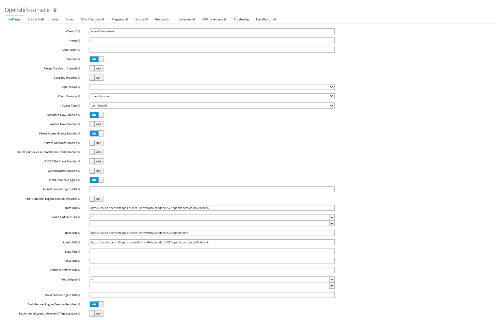
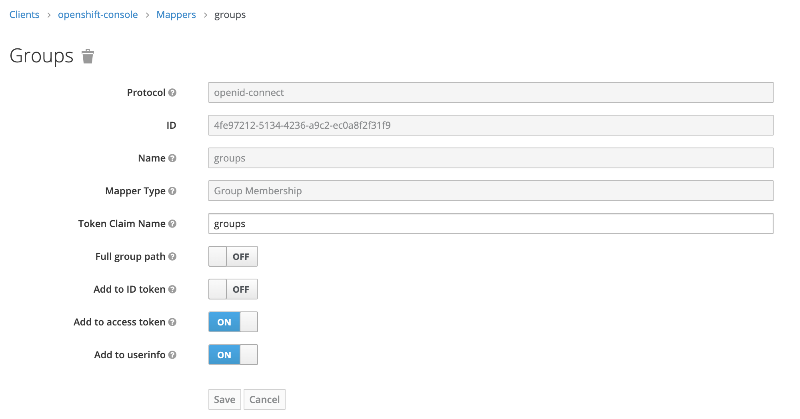

# Setting up Red Hat Build of Keycloak

## Step 1:  Install the Operator on OpenShift.

1. Create a `project` in which you will install the operator.
> ex: sso-app
2. Install the operator. Leave all default, install in the namespace create at step 1.
3. Go to the Operator View, create a keycloak instance. Leave all default.
	- this will create 2 pods ( Database and instance )
	- Create the different services ( 4 in total, + 1 for metrics )
	- Create the route you need to access keycloak
	- create the required secret for the admin ( credential-[name_of_keycloak_instance )
	- Insert the storage class name ( underwise it is ephemeral )
4. Select the route to access KeyCloak and go into the admin console, credential are found in the secret, _credential-name_of_keycloak_instance_

---

## Step 2: Configure Keycloak

1. Start by creatin a Realm. 
    > ex: openshift
2. Create group(s).
3. Create user(s).
4. Create a client to use for the OpenID connect IDP.
    > ex:openshift-sso
    * `Access Type`: confidential
    * `Fron Channel Logout`: true
    * `Root URL`: ex: https://oauth-openshift.apps.cluster-9xhhv.9xhhv.sandbox1572.opentlc.com/oauth2callback/
    * `Valid Redirect URIs`: *
    *  `Base URL`: ex: https://oauth-openshift.apps.cluster-9xhhv.9xhhv.sandbox1572.opentlc.com
    * `Admin URL`: ex: https://oauth-openshift.apps.cluster-9xhhv.9xhhv.sandbox1572.opentlc.com/oauth2callback/
    * `Web Origins`: +

    
5. SAVE
6. Create a Mappers for the groups
    * Go to the Mappers tabs.
    * Select create
    * Create the protocol Mapper.
    

---


## Step 3:

At this level there is different Option depending where the OpenShift cluster reside.

1. [For a standard cluster](configure_OAuth.md)
2. [For a cluster on ROSA](rosa-sso.md)

---

## Step 4: Enter the logout option from the console

1. Go to Cluster Setting -> Configuration -> Console
2. Edit the Yaml.

```
spec:
  authentication:
    logoutRedirect: >-
      https://keycloak-rh-sso.apps.cluster-9xhhv.9xhhv.sandbox1572.opentlc.com/auth/realms/openshift/protocol/openid-connect/logout
```

---
### Trouble shooting with group and KubeAdmin CLI.
Liens intéressant.

https://www.tutorialworks.com/openshift-cluster-admin/


* Connect as KubeAdmin
* Create a group in Openshift.
```
oc adm groups new [group name]
```

* Add the user to a groups
```
oc adm groups add-users [GROUP] [USER]
```

* Add cluster admin to a group
```
oc adm policy add-cluster-role-to-group cluster-admin [GROUP]
```
